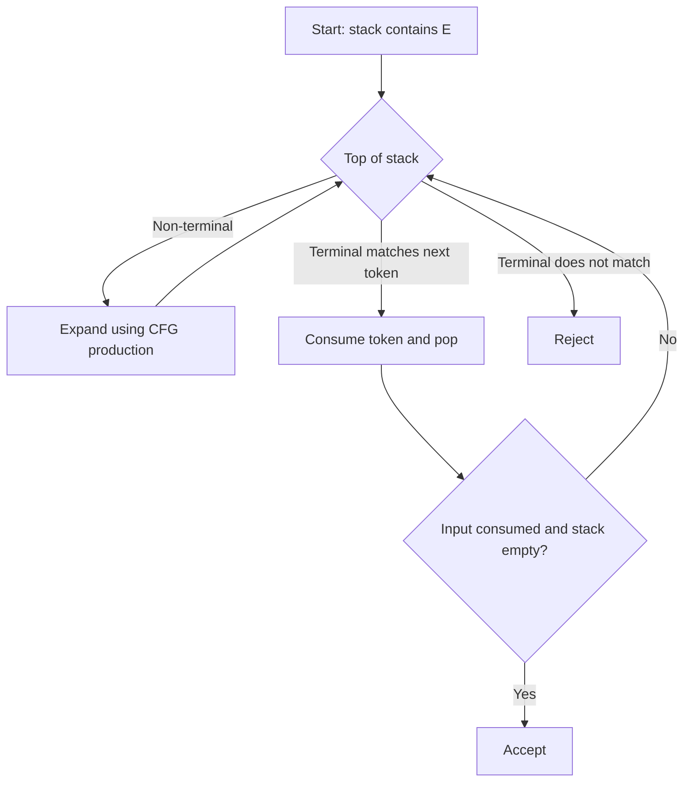

# Arithmetic Expression CFG Parser

The CFG-driven PDA parser starts with `E` on its stack. It expands non-terminals using the productions and matches terminals against the input tokens.

```mermaid
flowchart TD
    A[Start: stack contains E] --> B{Top of stack}
    B -->|Non-terminal| C[Expand using CFG production]
    B -->|Terminal matches next token| D[Consume token and pop]
    B -->|Terminal does not match| R[Reject]
    C --> B
    D --> E{Input consumed and stack empty?}
    E -->|Yes| Y[Accept]
    E -->|No| B
```
