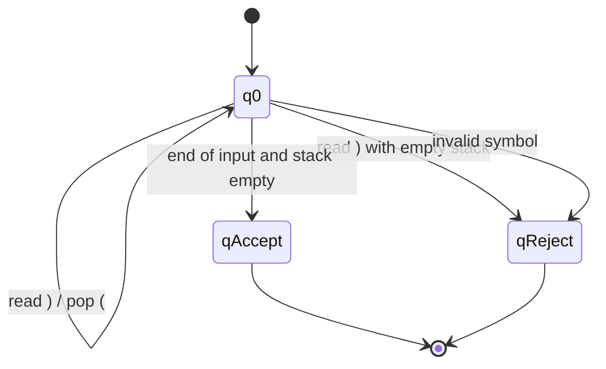

# Balanced Parentheses PDA

```mermaid
stateDiagram-v2
    [*] --> q0
    q0 --> q0: read ( / push (
    q0 --> q0: read ) / pop (
    q0 --> qReject: read ) with empty stack
    q0 --> qReject: invalid symbol
    q0 --> qAccept: end of input and stack empty
    qAccept --> [*]
    qReject --> [*]
```
