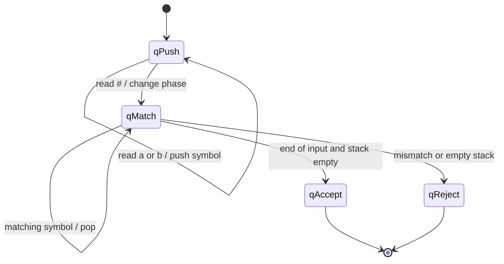

# Palindrome PDA with a middle marker

```mermaid
stateDiagram-v2
    [*] --> qPush
    qPush --> qPush: read a or b / push symbol
    qPush --> qMatch: read # / change phase
    qMatch --> qMatch: matching symbol / pop
    qMatch --> qReject: mismatch or empty stack
    qMatch --> qAccept: end of input and stack empty
    qAccept --> [*]
    qReject --> [*]
```
